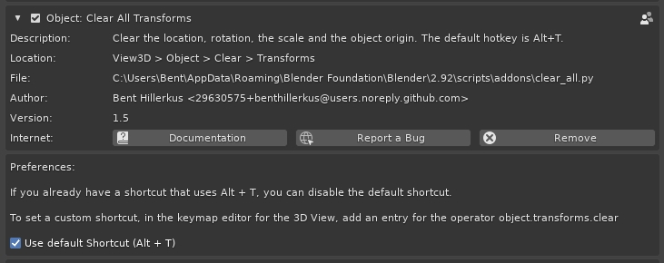

# Clear All Transforms
Blender add-on for clearing all transforms in object mode.

## Installation
1. Download **clear_all.py** from the [latest release](https://github.com/benthillerkus/clear_all/releases)
2. In Blender:
  1. Go to `Edit > Preferences > Add-ons > Install`
  2. Select your downloaded script
  3. Click *Install Add-on*
  4. Make sure you have the box next to *Object: Clear All Transforms* clicked.
  
Feel free to delete the script now. Blender already copied it into its add-ons folder.

## Usage
 Clear > Transforms to reset all of the transforms." width=75% height=75%>
You can either use the menu entry or just use the shortcut (Alt + F6). You can also reset the transformations of multiple items.

In the F6-menu you can choose to only reset some parameters or to also reset the delta transformations.

## Settings
You can uncheck *Use default shortcut (Alt + T)* if you don't want to have the add-on set this default shortcut.

### Setting a custom shortcut
If you aren't happy with the default shortcut, you can set a custom shortcut.
The operator you want to set the shortcut for is `object.transforms_clear`.

