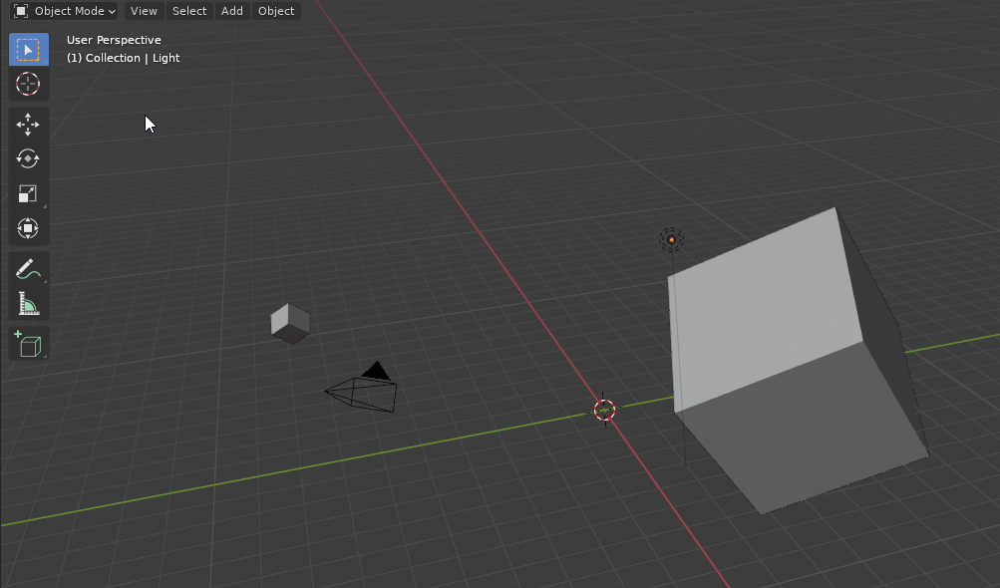
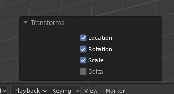
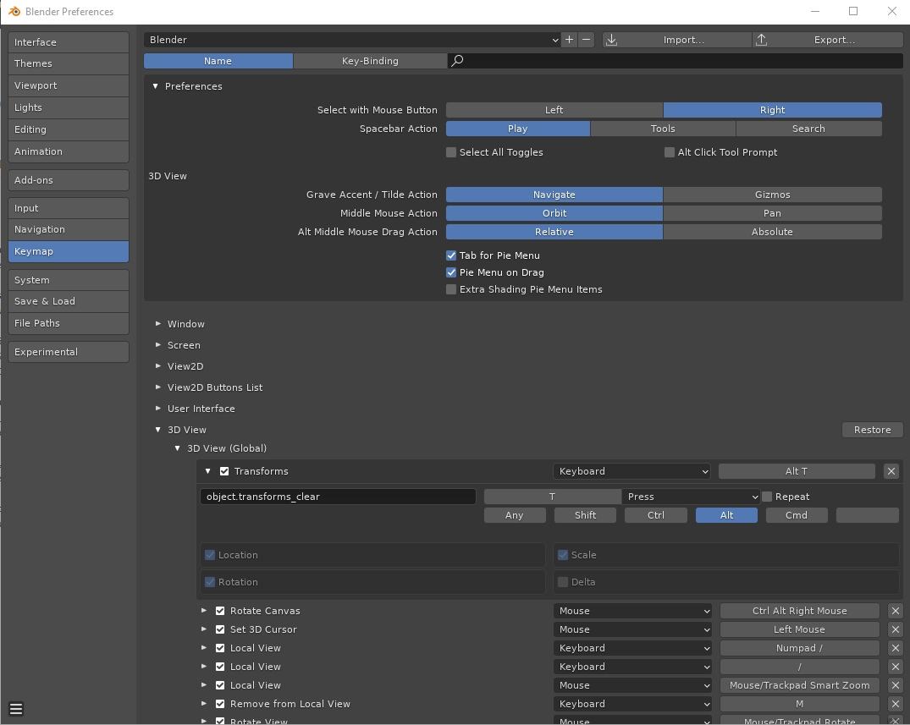

# Clear All Transforms
Blender add-on for clearing all transforms in object mode.

## Installation
1. Download [clear_all.py](https://raw.githubusercontent.com/benthillerkus/clear_all/main/clear_all.py)
2. In Blender:
  1. Go to `Edit > Preferences > Add-ons > Install`
  2. Select your downloaded script
  3. Click *Install Add-on*
  
## Usage
 
You can either use the menu entry or just use the shortcut (Alt + F6). You can also reset the transformations of multiple items.

 
In the F6-menu you can choose to only reset some parameters or to also reset the delta transformations.

## Settings
You can uncheck *Use default shortcut (Alt + T)* if you don't want to have the add-on set this default shortcut.

### Setting a custom shortcut
If you aren't happy with the default shortcut, you can set a custom shortcut.
 

The operator you want to set the shortcut for is `object.transforms_clear`
